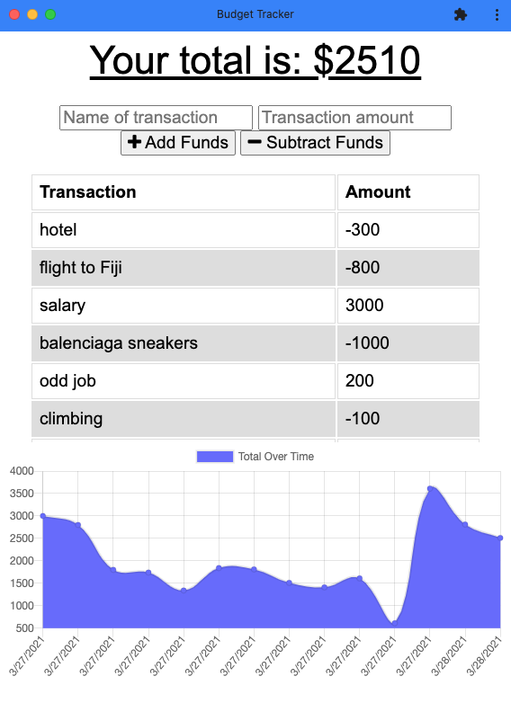
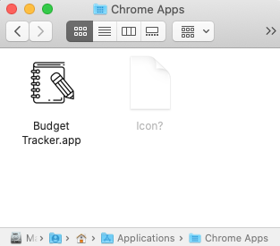

# Budget Tracker

## Description

An application that allows you to keep track of your finances even when you have no access to an internet connection.

Deployed app :link: https://ancient-bastion-90518.herokuapp.com/

Github repository :link: https://github.com/avpizarro/budgetTracker.git

## Table of Contents

- [Installation](#installation)
- [Usage](#usage)
- [License](#license)
- [Questions](#questions)

## Installation

Visit this link to start ussing the app :link: https://ancient-bastion-90518.herokuapp.com/

## Usage

Add income or expenses to keep track of the money you have left. Each transaction will need a description and an amount, the total and the chart will update accordingly so you can keep an eye on your budget. Install the Budget app on your device and use it when you are offline, the data will update automatically next time you connect to the internet.

## License

This Source Code Form is subject to the terms of the MIT License.
If a copy of the License was not distributed with this file, You can obtain one at https://opensource.org/licenses

## Questions

For further information please visit my GitHub page:
https://github.com/avpizarro

Or email me directly :e-mail: avpizarro@live.com
